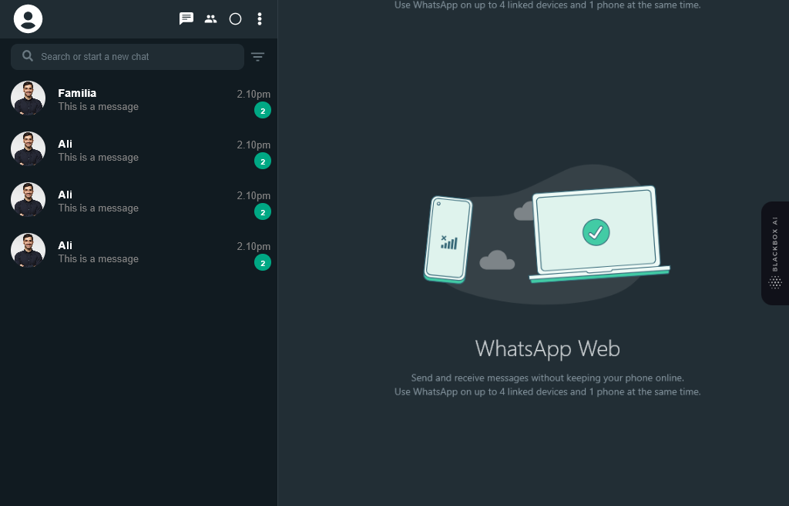

# WhatsApp Clone with MERN Stack and Socket.IO

This project is a WhatsApp clone built using the MERN (MongoDB, Express.js, React, Node.js) stack and Socket.IO for real-time messaging.



## Features

- Real-time messaging using Socket.IO.
- User authentication and registration.
- Group chats and direct messaging.
- ...

## Getting Started

### Prerequisites

- Node.js
- MongoDB
- React
- Express 

### Installation

1. Clone the repository:

   ```bash
   git clone https://github.com/hsuntariq/whatsapp-clone.git
   cd whatsapp-clone
